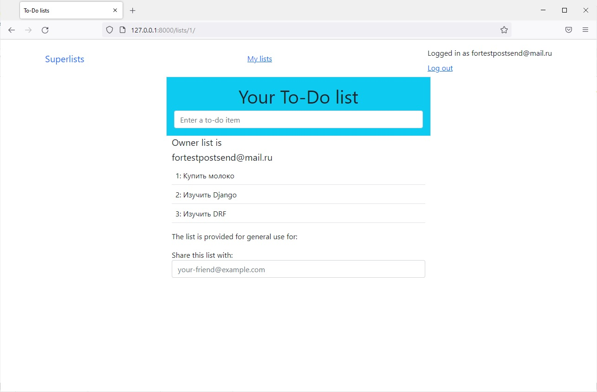

# Superlists
___


Онлайн приложение со списком неотложных дел.
В данном приложении можно регистрироваться,
создавать свои списки, просматривать их и поделиться ими 
с другими пользователями.


## Настройка перед запуском

Первое, что нужно сделать, это cклонировать репозиторий:

```sh
$ git clone https://github.com/Andrei2020-web/Superlists.git
$ cd superlists
```

Создайте виртуальную среду для установки зависимостей и активируйте ее:

```sh
$ virtualenv venv
$ source venv/bin/activate
```

Затем установите зависимости:

```sh
(venv)$ pip install -r requirements.txt
```

Запускаем сервер:

```sh
(venv)$ python manage.py runserver
```
